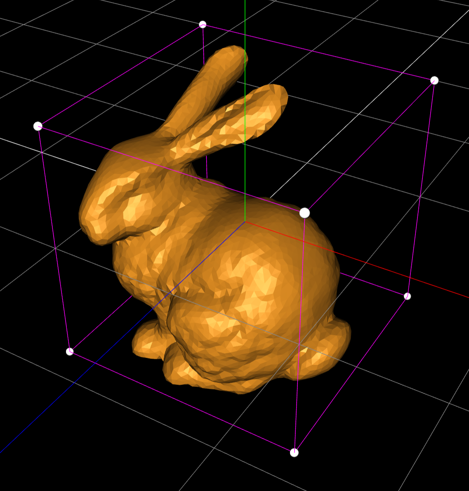
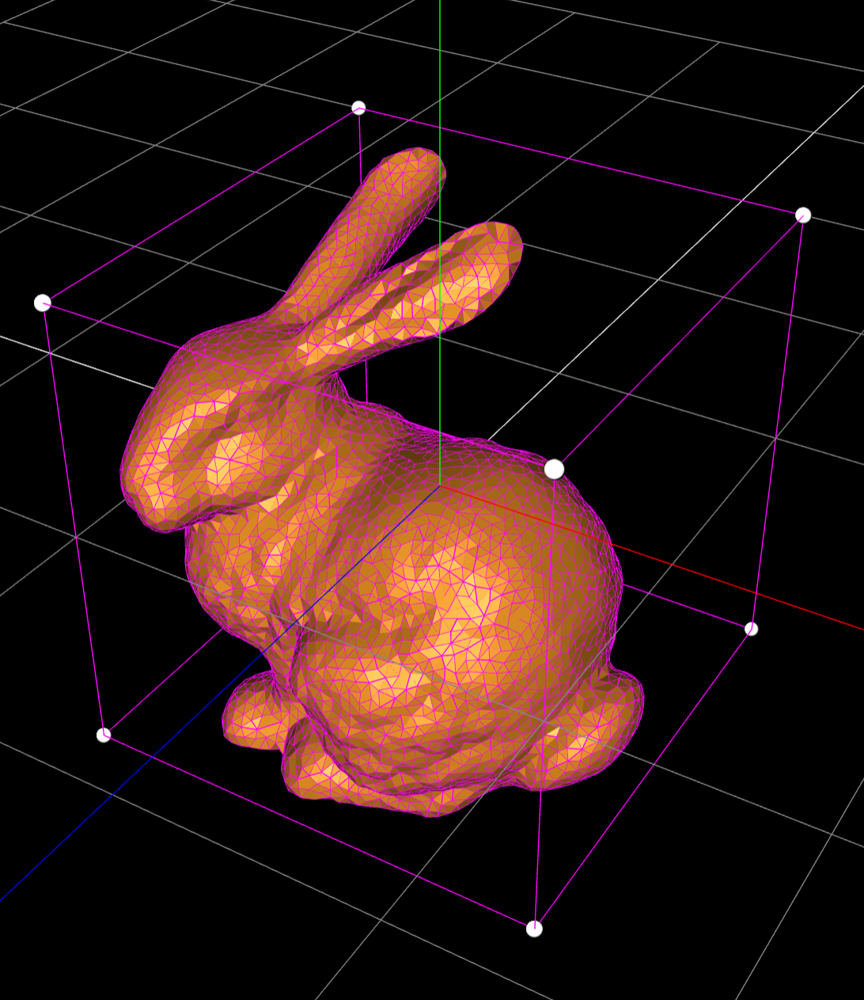
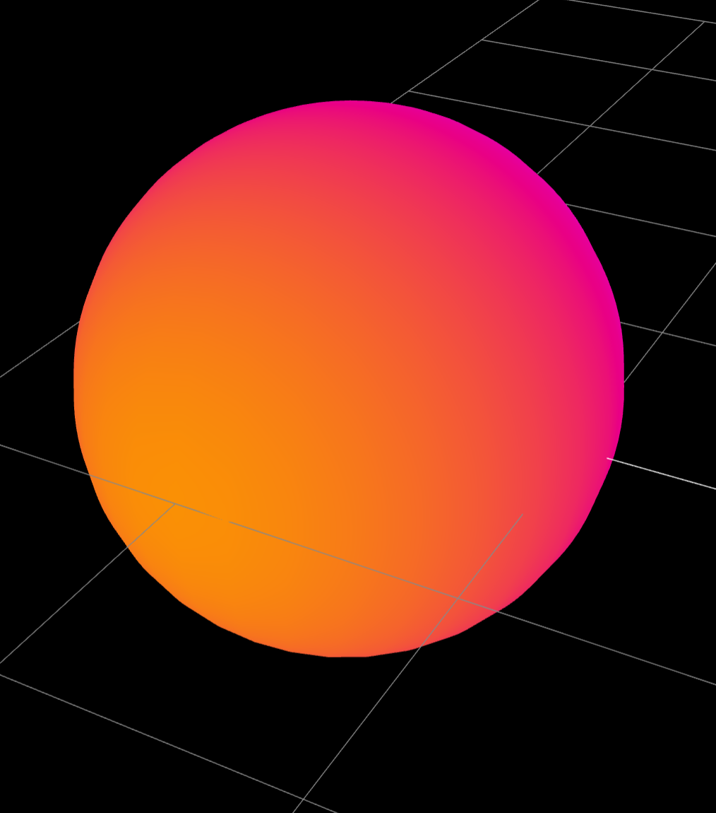
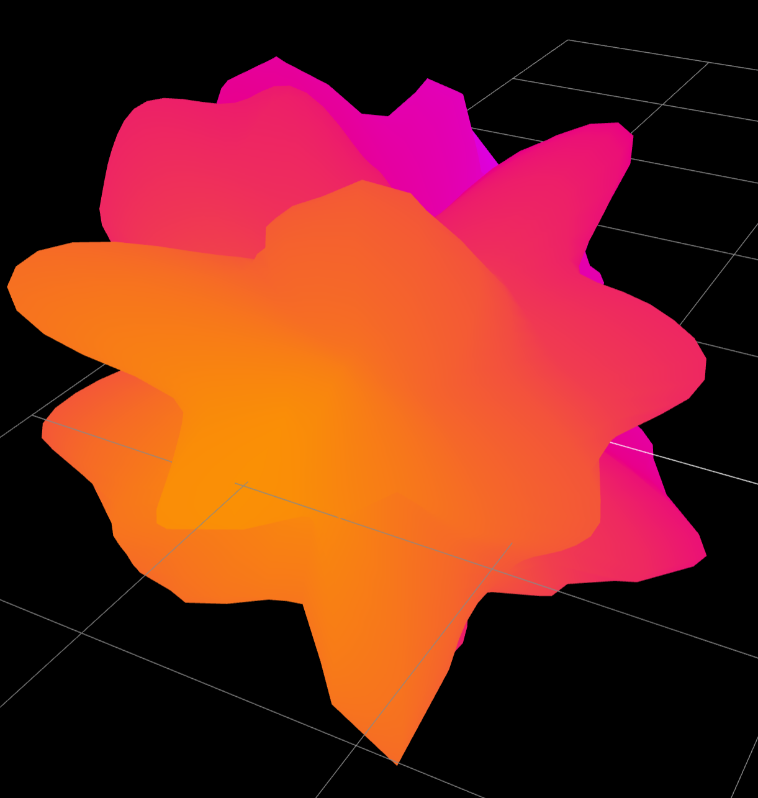
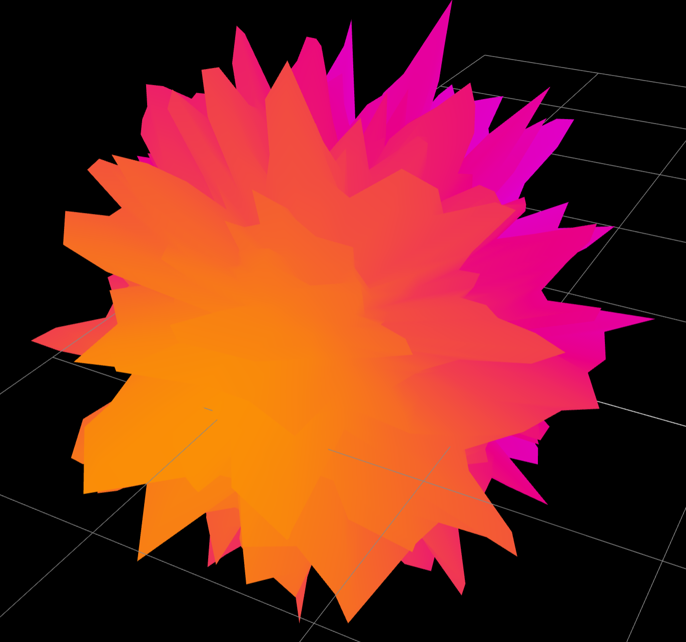
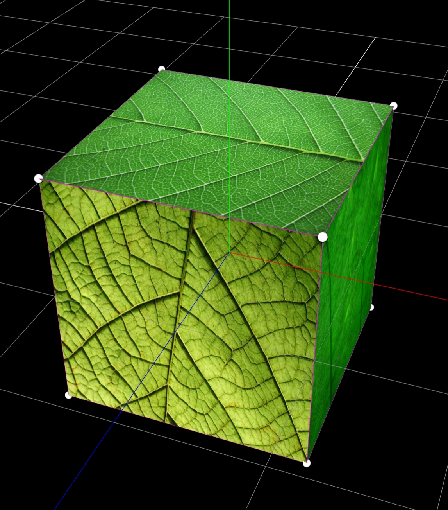

# webgl-visual-computing
Project for 2nd year Visual Computing course @ University of Bath, Autumn 2021. Written in WebGL, featuring 3D object rendering, camera manipulations and an implementation of Perlin Noise using shaders. Submitted 1st/~150 students, scoring a final grade of 100%.   

   
```scripts/```
- ```main.js```: core functionality and 3D environment
- ```main.html```: base html file to load scripts, with instructions for use printed to console 
- ```three-r134.js```: pre-built 3D object rendering engine
- ```perlin.js```: script for Perlin noise shader, applied to 3D sphere in main.js

To run using a simple Python http server 

```bash
python -m http.server
```

(defaults to http://localhost:8000)

Alternatively to run using node.js
```bash
npm install -g http-server
http-server
```

(defaults to http://localhost:8000)

# Gallery 


   
   


   
   
   


   
